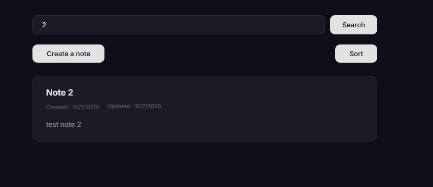
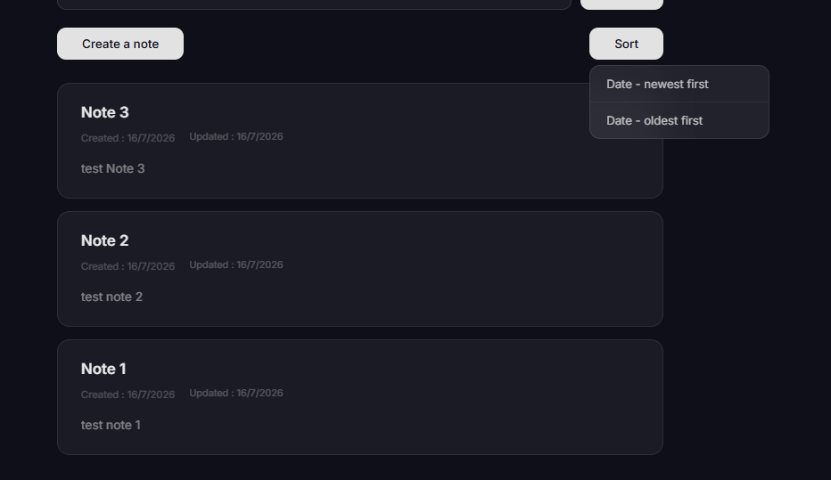
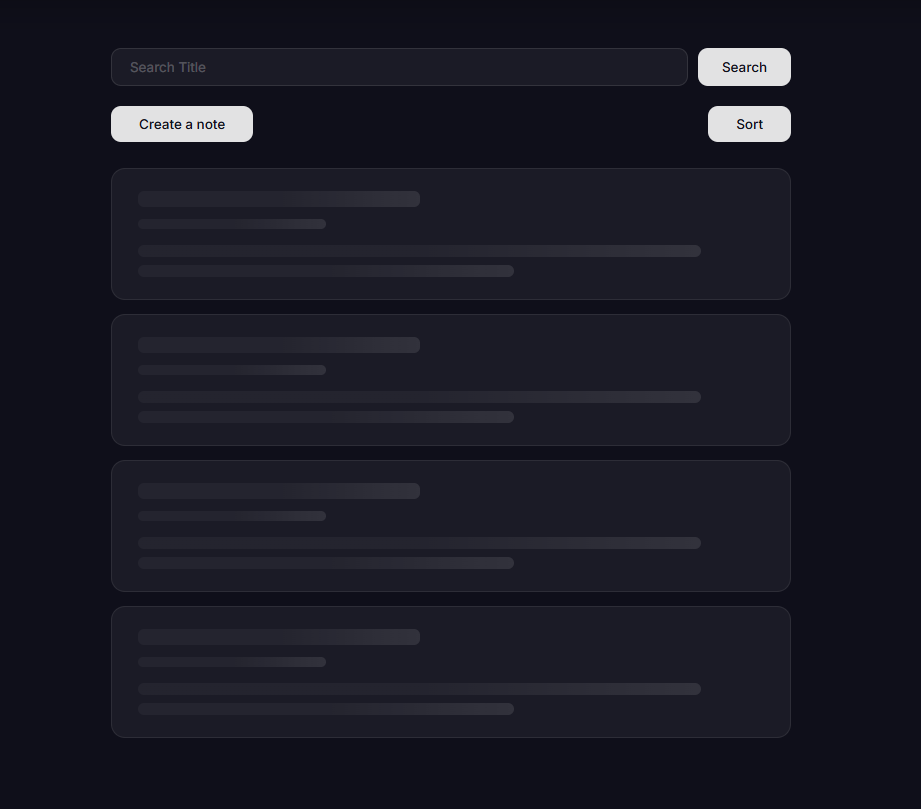

# Notely

A fullstack notes app built with React, Express, and MongoDB. Dark-themed UI, TypeScript across the entire stack.


## What it does

- Create, read, edit, and delete notes
- Search notes by title
  
- Sort by newest or oldest
  
- Shimmer loading skeletons while data loads
  
- Error handling on both client and server
  
- Typed API responses with generics (`ApiResponse<T>`)

## Tech stack

**Frontend:** React 19, TypeScript, React Router v7, Vite

**Backend:** Express 5, Mongoose, TypeScript

**Database:** MongoDB Atlas

## Project structure

```
├── client/
│   └── src/
│       ├── components/     # NoteList, CreateNote, EditNote, NotePage, Header
│       ├── assets/         # App logos
│       ├── App.tsx         # Router setup with createBrowserRouter
│       └── type.ts         # Shared interfaces (Note, ApiResponse, NewNote)
├── server/
│   └── src/
│       ├── controllers/    # CRUD logic for notes
│       ├── db/             # Mongoose connection and Note model
│       ├── routes/         # Express router
│       ├── types.ts        # ApiResponse interface
│       └── index.ts        # Server entry point
```

## Running locally

You'll need Node.js and a MongoDB instance (local or Atlas).

**Server:**

```bash
cd server
npm install
```

Create a `.env` file in `/server`:

```
PORT=3000
DB_URI=your_mongodb_connection_string
DB_NAME=notely
```

```bash
npm run dev
```

**Client:**

```bash
cd client
npm install
```

Create a `.env` file in `/client`:

```
VITE_API_URL=http://localhost:3000/api/notes
```

```bash
npm run dev
```

App runs at `http://localhost:5173`.

## What I learned building this

- Setting up a monorepo-style project with separate client/server folders
- Mongoose schemas with `InferSchemaType` for type safety without duplicating interfaces
- React Router v6+ data router pattern (`createBrowserRouter` + `Outlet`)
- Structuring API responses with a consistent `{ success, message, data }` shape
- Handling loading, error, and empty states properly in the UI
